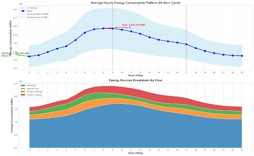
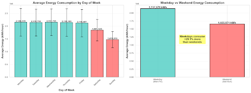

# KPMG AI Studio — Building Energy Optimization & Forecasting (KPMG NYC Office)

Predicting and reducing commercial building energy consumption using ML on NREL Large Office Building datasets, with recommendations tailored to **KPMG’s Manhattan workspace**.

## Team
| Name | GitHub | Primary Contributions |
|---|---|---|
| Amber li | [@amberhli](https://github.com/amberhli) | Project management, modeling experiments, final recommendations synthesis |
| Anour Ibrahim | [@anouribrahim10](https://github.com/anouribrahim10) | Data preprocessing, feature engineering, notebook pipeline |
| Adike Noble | [@kingnaddy](https://github.com/kingnaddy) | EDA + visualizations, insight generation |
| Anveetha Suresh | [@anveetha](https://github.com/anveetha) | Baseline + model evaluation, metrics and comparisons |
| Lucy Liu | [@lucyrliu](https://github.com/lucyrliu) | Documentation, slide narrative, business framing |


## Project Highlights (Outcomes)
- Built an end-to-end pipeline for **15-minute interval** building energy analysis (cleaning → EDA → features → modeling → insights).
- Developed forecasting models that achieved **~0.93–0.94 R²** and **~3.9–4.0% MAPE**, substantially outperforming a simple baseline.
- Identified strong operational patterns (business hours vs after-hours, weekday vs weekend, seasonal effects) that point to controllable savings.
- Produced actionable operational recommendations (HVAC setbacks, smart lighting/plug controls) aligned with a **15%+ energy savings target**.

---

## Table of Contents
- [Business Problem](#business-problem)
- [Data](#data)
- [Repository Structure](#repository-structure)
- [Setup & Installation](#setup--installation)
- [How to Run](#how-to-run)
- [Exploratory Data Analysis](#exploratory-data-analysis)
- [Modeling Approach](#modeling-approach)
- [Results & Key Findings](#results--key-findings)
- [Code Highlights](#code-highlights)
- [Discussion & Reflection](#discussion--reflection)
- [Next Steps](#next-steps)
- [License](#license)

---

## Business Problem
Commercial office buildings are major energy consumers. For KPMG’s new NYC workspace, the goal is to:
1) **Forecast energy consumption** accurately, and  
2) **Identify high-impact operational levers** that can reduce usage (targeting **15%+ savings**) without disrupting occupancy needs.

### Why this matters to KPMG
- Energy is a controllable operating cost—better forecasting and control reduces spend.
- Sustainability goals benefit from reducing electricity and HVAC loads (often the largest drivers).
- Practical operational insights (HVAC schedules, lighting controls, plug-load management) can translate directly into building automation policies.

---

## Data
We evaluated multiple building datasets and selected **NREL Large Office Building** datasets due to strong alignment with U.S. commercial building assumptions and high-resolution time-series coverage.

### Source & Coverage
- **NREL Large Office Building datasets** (CSV)
- **15-minute interval** time-series over approximately **one year**
- Includes **site energy** and **end-use breakdowns** (e.g., heating/cooling, lighting, plug loads/IT, etc.)

### Files in this repo
Example datasets included:
- `up4-ny-largeoffice.csv`
- `up15-ny-largeoffice.csv`
Additional NREL files may appear under `data/nrel/raw/` (e.g., `up9`, `up12`) and cleaned outputs under `data/nrel/clean/`.

### Preprocessing Notes & Assumptions
Cleaning and preparation steps included:
- Timestamp parsing + sorting
- Missing value handling (imputation or row removal depending on feature criticality)
- Outlier checks (spikes/drops) to avoid misleading model training
- Feature engineering for time-series prediction (lags + rolling means)

> See `notebooks/1-data_collection_and_preprocessing.ipynb` for the full preprocessing workflow.

---

## Repository Structure
```text
.
├── data/
│   └── nrel/
│       ├── raw/                 # raw NREL CSVs (if provided)
│       └── clean/               # cleaned/processed CSVs
├── notebooks/
│   ├── 1-data_collection_and_preprocessing.ipynb
│   ├── linear_regression_lstm_eda.ipynb
│   └── nrel_analysis_recommendations.ipynb
├── docs/
│   └── figures/                 # exported plots used in README (recommended)
├── requirements.txt
├── README.md
└── .gitignore
```

---

## Setup & Installation
### 1) Clone the repo
```bash
git clone https://github.com/amberhli/kpmg-1a.git
cd kpmg-1a
```

### 2) Create & activate a virtual environment (recommended)
**macOS/Linux**
```bash
python -m venv venv
source venv/bin/activate
```

**Windows (PowerShell)**
```bash
python -m venv venv
.\venv\Scripts\Activate.ps1
```

### 3) Install dependencies
```bash
pip install -r requirements.txt
```

### 4) Launch Jupyter
```bash
jupyter lab
# or
jupyter notebook
```

---

## How to Run
Run notebooks in this order (top-to-bottom):
1. `notebooks/1-data_collection_and_preprocessing.ipynb`  
   Outputs cleaned datasets to `data/nrel/clean/`
2. `notebooks/linear_regression_lstm_eda.ipynb`  
   Performs EDA, feature engineering, and early modeling exploration
3. `notebooks/nrel_analysis_recommendations.ipynb`  
   Trains final models, evaluates results, and produces recommendations

**Expected outputs**
- Cleaned dataset files (CSV) in `data/nrel/clean/`
- Evaluation tables (baseline vs ML models)
- Exported visualizations (recommended to save to `visualizations`)

---

## Exploratory Data Analysis
Key EDA insights:
- Strong **daily cycle**: energy peaks during typical working hours and bottoms out overnight.
- **Weekdays > weekends**: office operational schedules drive higher weekday usage.
- **Business hours vs after-hours**: a large share of time is after-hours—making scheduling and setbacks a high-leverage savings lever.
- **Seasonality**: winter and summer loads increase (HVAC-driven).

### Annotated Visualizations (export from notebooks)
> Export these figures from the EDA notebook into `docs/figures/` to fully satisfy the rubric.

**1) Average hourly load shape (daily pattern)**  
*Figure 1. Daily energy pattern with annotation.*  


**2) Weekday vs weekend comparison**  
*Figure 2. Weekday vs weekend energy distribution with annotation.*  

---

## Modeling Approach
### Why these methods?
We used a **simple baseline** plus **tree-based regression models** because:
- Baselines (moving averages) are interpretable but often miss nonlinear patterns (seasonality, schedule shifts, interactions).
- **Random Forest** and **Gradient Boosting** handle nonlinearities well, are robust to noise/outliers, and perform strongly on tabular time-series features.
- We engineered time features + lag/rolling statistics to convert the forecasting task into a supervised learning problem.

### Feature Engineering (examples)
- Temporal: hour, day-of-week, month, business-hours flag
- Lags: 1 hour, 24 hours, 168 hours
- Rolling means: 24-hour and 168-hour windows

### Training & Evaluation
- Train/test split consistent with time-series workflow (no leakage)
- Metrics reported:
  - **MAPE** (interpretability for forecasting error)
  - **R²** (variance explained)
  - (optionally MAE/RMSE if included in notebooks)

---

## Results & Key Findings
### Model Performance Summary
| Model | R² | MAPE | Notes |
|---|---:|---:|---|
| Baseline (24h moving average) | ~0.28 | ~17.06% | Weak—can’t capture complex schedule/season effects |
| Random Forest Regressor | ~0.94 | ~3.87% | Best overall performance, robust and accurate |
| Gradient Boosting Regressor | ~0.93 | ~4.02% | Strong performance, captures subtle patterns |

### What drove energy usage most?
Insights consistently pointed to:
- HVAC (heating/cooling) and electricity-driven loads as key drivers
- After-hours consumption as a major optimization opportunity

### Recommendations for KPMG NYC Workspace
Operational actions aligned to observed patterns:
- **HVAC scheduling + setbacks** outside 7am–7pm weekdays (where appropriate)
- **Smart lighting** (occupancy + daylight sensors) for conference rooms, corridors, restrooms
- **Plug-load controls** (smart plugs/power management for office equipment)
- **Programmable thermostats / time-of-use strategies** to reduce peak demand

---

## Code Highlights
| File/Notebook | What it does |
|---|---|
| `notebooks/1-data_collection_and_preprocessing.ipynb` | Ingests raw NREL CSVs, cleans timestamps, handles missing values/outliers, writes cleaned outputs |
| `notebooks/linear_regression_lstm_eda.ipynb` | EDA + feature creation (lags/rolling), exploratory modeling (linear/LSTM context) |
| `notebooks/nrel_analysis_recommendations.ipynb` | Final modeling, evaluation, and recommendation generation based on findings |
| `data/nrel/raw/` | Raw NREL datasets (if included) |
| `data/nrel/clean/` | Cleaned datasets used for modeling |

---

## Discussion & Reflection
What worked:
- Feature engineering + tree-based regression produced strong accuracy and stability.
- EDA clearly surfaced operational patterns that translate into actionable control policies.

What didn’t (or limitations):
- Simple baselines underperformed due to nonlinear seasonality and schedule-driven variation.
- Dataset is a proxy for a specific office environment—direct transfer to KPMG may require calibration with real building telemetry (occupancy, HVAC setpoints, equipment inventory, weather feed).

Why it matters:
- Forecasting is only valuable if it drives decisions—our analysis focused on levers KPMG can operationalize (controls, schedules, and targeted retrofits).

---

## Next Steps
- Add **NYC weather features** (temperature, humidity) and validate lift in accuracy.
- Integrate **occupancy / badge / room scheduling signals** to improve schedule sensitivity.
- Move from prediction → **optimization** (recommend setpoint/schedule policies that minimize energy under comfort constraints).
- Test **sequence models (LSTM/Temporal CNN)** on multi-step forecasting and compare against tree models.
- Package the pipeline into a reproducible script (`src/`) with configuration files and a single command to regenerate results.

---

## License
This project is licensed under the [MIT License](LICENSE)
